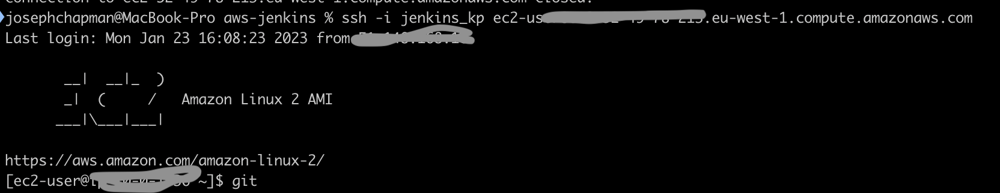
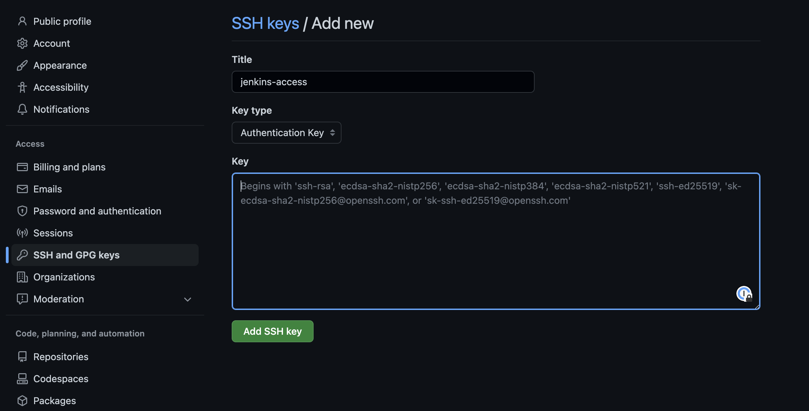
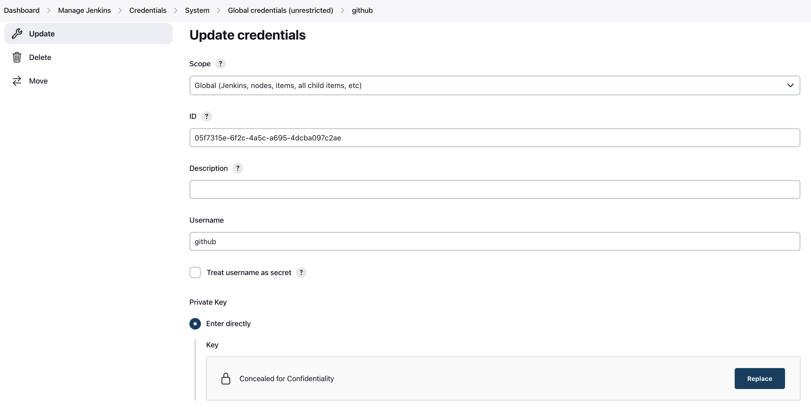

# Configure Jenkins to clone projects from GitHub

Before Jenkins can clone a project from Git, the user must first  share a private/public key pair with Jenkin and GitHub, and install Git into Jenkins.


1. SSH in to the EC2 instance with the private key you created for EC2
```
ssh -i jenkins_kp ec2-user@<your_server_public_DNS>
```


2. Install Git on to the EC2 instance
```
sudo yum install git -y
```

3. Change to "jenkins" user
```
sudo -su jenkins 
```

4. Generate a key pair with default settings 
```
ssh-keygen
```

5. Add the key to the ssh agent
```
eval $(ssh-agent -s)
ssh-add ~/.ssh/id_rsa
```

6. Copy the public key to add to GitHub
```
cat /var/lib/jenkins/.ssh/id_rsa.pub
```

7. Add the public key to any Github user account that has read access to the project



8. Add the private key for GitHub access to Jenkins credentials



9. Back in the EC2 instance, change to "jenkins" user and update SSH know_hosts
```
ssh -i jenkins_kp ec2-user@<your_server_public_DNS>
sudo -su jenkins

ssh -T git@github.com
```

10. Enable proxy compatibility from the Jenkins Dashboard

"Manage Jenkins" > "Configure Global Security" > "Enable proxy compatibility"

