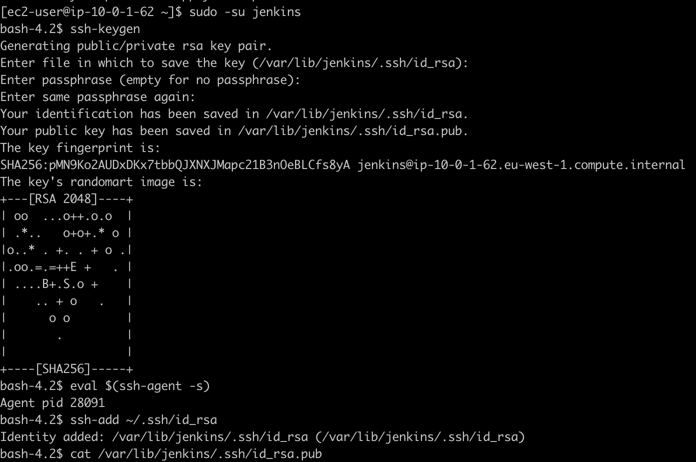

# Configure Jenkins to clone projects from GitHub

1. SSH in to the EC2 instance with the private key you created
```
ssh -i jenkins_kp ec2-user@<your_server_public_DNS>
```

2. Change user
```
sudo -su jenkins 
```

3. Generate a key pair and add to ssh agent
```
ssh-keygen
eval $(ssh-agent -s)
ssh-add ~/.ssh/id_rsa
```

4. Copy the public key
```
cat /var/lib/jenkins/.ssh/id_rsa.pub
```



5. Add the public key to your Github user account

6. Enable proxy compatibility

"Manage Jenkins" > "Configure Global Security" > "Enable proxy compatibility"

