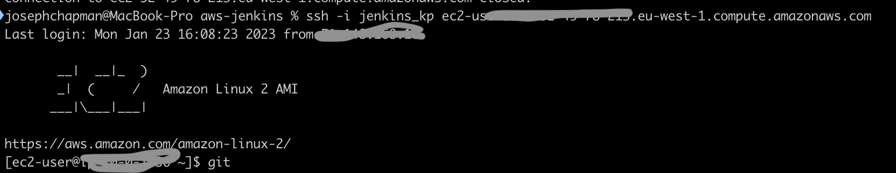

# Configure Jenkins to with Terraform

Before Jenkins can provision AWS services and features, the terraform excutable must be installed on the Jenkins VM

1. SSH in to the EC2 instance with the private key you created for EC2
```
ssh -i jenkins_kp ec2-user@<your_server_public_DNS>
```


2. Get the latest release version of Terraform.
```
TERRAFORM_VER=`curl -s https://api.github.com/repos/hashicorp/terraform/releases/latest |  grep tag_name | cut -d: -f2 | tr -d \"\,\v | awk '{$1=$1};1'`
```

3. Download the latest release of Terraform on Amazon Linux 2
```
wget https://releases.hashicorp.com/terraform/${TERRAFORM_VER}/terraform_${TERRAFORM_VER}_linux_amd64.zip
```

4. Extract the file
```
sudo yum -y install unzip
unzip terraform_${TERRAFORM_VER}_linux_amd64.zip
```

5. Move binary file to the /usr/local/bin directory:
```
sudo mv terraform /usr/local/bin/
```

6. Confirm installation by checking the version of Terraform.
```
terraform version

// Terraform v0.13.5
```

7. Enable tab completion:
```
terraform -install-autocomplete
source ~/.bashrc
```