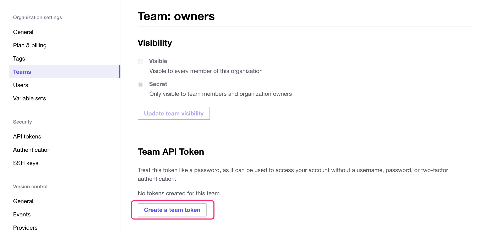
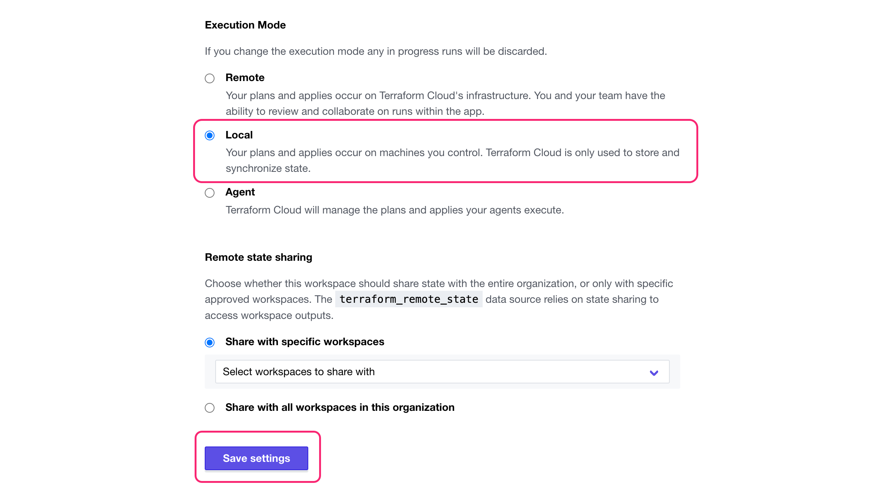

# Terraform Cloud

1. Create a Terraform Cloud account

2. Create a Terraform Cloud token and save it securely (CircleCI will need this)

3. In the Terraform Cloud UI, create a new CLI-driven workspace named aws-jenkins

4. On the workspace overview page, click on the curent Execution Mode to navigate to the general settings

